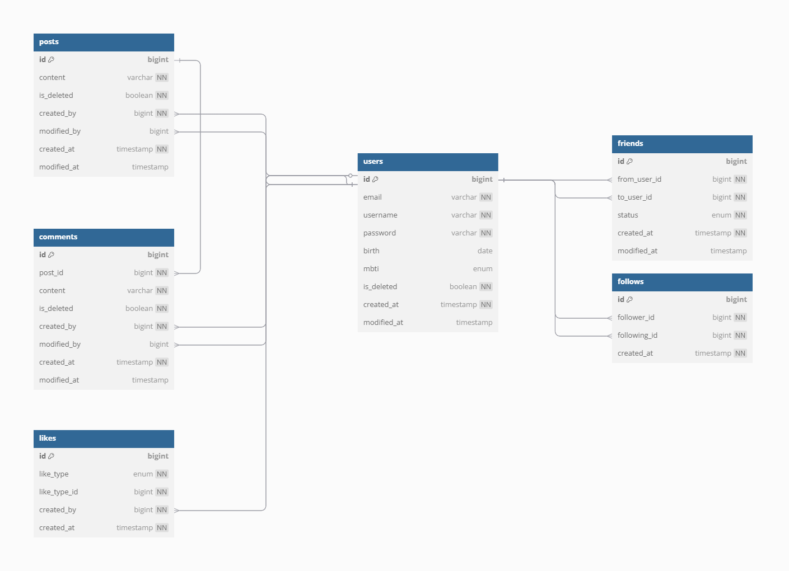

# 인스타드인

**sns** api 서비스로 인스타그램과 링크드인의 일부 기능을 참고하여 SNS 서버를 구현하기 위해 최소한의 기초적인 API를 제공하는 서버입니다.

## 실행 방법

1. `git clone --branch main https://github.com/nagul2/basic-sns-api.git`
2. IntelliJ 실행 및 Open Project (`main` 브랜치)
3. `src/main/resources/config/local/application.yml` 파일의 url, username, password를 환경에 맞게 수정
4. 스프링 애플리케이션 실행

## 🛠️ **주요 기능**
### API
- 뉴스피드 CRUD
- 뉴스피드 댓글 CRUD
- 회원 CRUD
- 인증(세션, 필터를 활용한 로그인, 로그아웃)
- 친구 관리 CRUD
- 회원 팔로우 CRUD
- 좋아요 CRUD

### COMMON
- 실행 시간 LOG AOP
- Spring data jPA Auditing: 생성일, 수정일, 생성인, 수정인 자동 기록
- 예외 처리 핸들링
- 공통 응답 객체를 생성하여 응답 통일성 강화
- @EventListener()를 활용한 더미데이터 생성

## 📜 관련 문서

### API
- [API 명세서](https://alkaline-earth-ef5.notion.site/API-1d3eb3cc1985808aa86de72045c88f6f)
- [포스트맨 API 문서](https://documenter.getpostman.com/view/44033913/2sB2ca5z2i)

### ERD
- [dbdiagram.io](https://dbdocs.io/swstar21c/sparta-sns?view=relationships)

### 트러블슈팅
- [[트러블슈팅] 뉴스피드 목록 조회 쿼리 최적화 및 테스트 (수동)](https://velog.io/@ncookie/%ED%8A%B8%EB%9F%AC%EB%B8%94%EC%8A%88%ED%8C%85-%EB%89%B4%EC%8A%A4%ED%94%BC%EB%93%9C-%EB%AA%A9%EB%A1%9D-%EC%A1%B0%ED%9A%8C-%EC%BF%BC%EB%A6%AC-%EC%B5%9C%EC%A0%81%ED%99%94-%EB%B0%8F-%ED%85%8C%EC%8A%A4%ED%8A%B8-%EC%88%98%EB%8F%99)

## 🔧 **기술 스택**

- **프레임워크:** Spring 6.2.5, Spring Boot 3.4.4
- **ORM:** JPA hibernate:7.0.3, Querydsl 5.1.0
- **언어:** Java 17
- **데이터베이스:** MySQL
